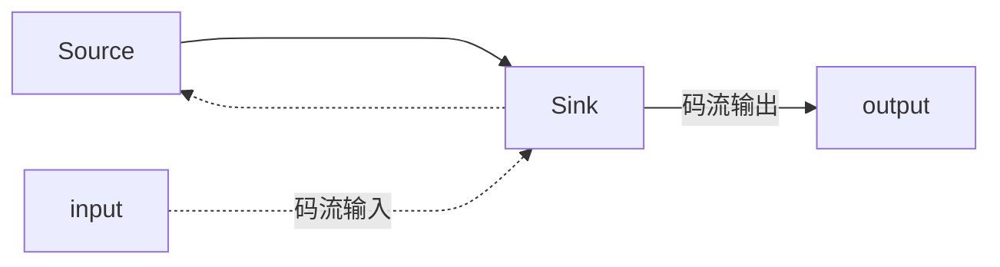
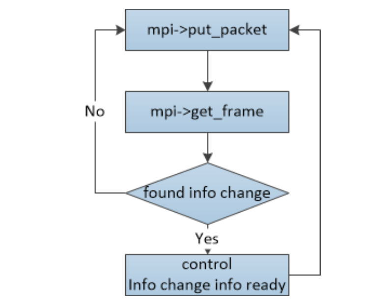

# live555_mpp_client
## 1.Abstract

在Live555框架下使用rk3588进行拉流加速。由于[rk_live555](https://github.com/EZreal-zhangxing/rk_live555)项目中有高度定制，和rk3588的编码器特性绑定。

例如进行码流拼接，使用FIFO/队列进行数据流转。

同时也是进行框架学习的一个草稿项目。因此在进行网络拉流的时候是无法满足要求的。所以开了这个坑来填。

本项目满足如下特性：

- [x] RK3588硬件解码
- [x] Live555 框架接入
- [x] Drm显示架构
- [x] 平均延迟20ms以下
- [x] 海康网络摄像头拉流

## 2.环境要求

- [x] rockchip_mpp
- [x] libdrm
- [x] live555

这三个包的安装与配置参见 rk_live555项目的 [环境配置.md](https://github.com/EZreal-zhangxing/rk_live555/blob/main/%E7%8E%AF%E5%A2%83%E9%85%8D%E7%BD%AE.md)

## 3. 编译

编译文件见`CMakeLists.txt`

其中自定义了两个变量：`MPP_INCLUDE_PATH`, `MPP_LIB`，分别指向`rockchip_mpp`的安装位置

同时从环境变量中引用了：`LIVE555_LIB`,`LIVE555_INCLUDE` 指向live555的安装位置

`Opencv`是后续使用其他功能预留的，如果仅作拉流与显示可以去掉。

```bash
mkdir build
cd build
cmake ..
make -j16 
```

## 4. 运行

通过如下命令运行即可：

```bash
sudo ./main rtsp://<username>:<password>@ip:port/<url>
```

## 5. 流程梳理

### 5.1 live555 数据读取梳理

`live555` 架构底层使用`socket`一套来进行网络数据读取，与传统阻塞式读取不同的地方在于，使用`select`函数来有选择性的轮询数据准备好的套接字，并进行读取，这样的好处是避免了阻塞以及非阻塞式对CPU时间片的占用。

之所以是说他是基于事件的，是因为它同时定义了三种任务，`EventTrigger`,`scheduleDelayedTask`,`basicTaskScheduler` 

`live555`的入口是`doEventLoop`，该方法的主体函数是`BasicTaskScheduler.cpp:SingleStep()`

可以见到使用`select`等待套接字接收数据后，遍历所设置的事件。

其中我们的函数入口则是`openURL`，为了能优雅的关闭流。我将`rtspClient`定义在了`rtsp_client.cpp`里，同时在`rtsp_client_live555.h`中创建了一个`shutdownStream()`函数。该函数主要作用是发送`BYE`协议

### 5.2 代码解析

原始代码可以参考 `testProgs/testRTSPClient.cpp`

#### 5.2.1 ourRtspClient

主要内容是创建一个`ourRtspClient`对象，这个对象主要负责和网络设备进行`rtsp`协议的握手，因为我没有需要自定义的握手操作协议，所以我只继承了`RTSPClient` 不做任何方法重写。仅在构造器中进行父类(`RTSPClient`)的初始化

#### 5.2.2 DummySink

这个类主要负责数据的读入。当套接字读取数据后，我们通过`DummySink`类从`source`中读取数据并进行后续的处理。

同样的对于`*sink`类也可以读取数据到`server`中进行发送等其他操作

该对象继承`MediaSink`类，这里面主要有两个私有成员比较关键:

1. `fReceiveBuffer` 该`buffer`用来从`source`中获取网络读到的视频流数据，通过`DummySink::continuePlaying()`函数调用，调用父类的`FramedSource * fSource`对象的`getNextFrame`方法将得到的下一包数据写入该`buffer`。写入后通过设置回调方法`afterGettingFrame`进行返回。
2. `fSubsession ` 该对象保存了当前流中所有的子流信息，例如音频流和视频流。

主要的流处理函数上诉也说过了，就是`afterGettingFrame`回调函数，这个函数决定了后续数据包收到后如何进行处理。

所以在该函数中对于视频流进行解码，对音频流同样也可以进行解码操作（在这个项目里，音频流是进行了丢弃处理）

在该回调函数中，主要逻辑如下：

```c++

if(std::string("video") == std::string(fSubsession.mediumName())){
    // 如果是视频流，则送入解码器
    decode_frame(fReceiveBuffer,frameSize,timestamp);
}
// 打印相关信息
#ifdef DEBUG_PRINT_EACH_RECEIVED_FRAME
    ...
#endif
// Then continue, to request the next frame of data:
// 调用continuePlaying() 进入下一个包的处理，形成闭环
continuePlaying();
```

处理流程图如下：

```
--------------------------------	callback       ---------------------------------
| DummySink::continuePlaying() | ----------------> | DummySink::afterGettingFrame() |
--------------------------------         |         ----------------------------------
			^					      |							|
			|					      V							|
			|				    -----------------			 -----------	        --------
			|				    | fReceiveBuffer |     -----> | decoder |  --------> | image |
			|				    ------------------			 -----------		   ---------
			|				    								|
			|				    								|
			|---------------------------------------------------------				    					

```

在这里的`afterGettingFrame`函数中，主要目的是将码流数据送入编码器。但送入编码器之前，我使用了两种方式，分别是自行拼包以及不拼包。

这两种模式分别对应了解码器的两种解码模式，是否分帧。

在网络上的`SPS`和`PPS`信息包以及包含视频信息的码流包是分开的。但他们有相同的时戳`presentationTime`

通过该时戳可以判断这三个包是不是同一个帧的信息。因此可以进行拼包封装。当`mpp`解码器设置自行分帧后，那么可以不进行人为拼包将这一部分交给解码器去做。

```c++
unsigned long int curTimestamp = presentationTime.tv_sec * 1000000 + presentationTime.tv_usec;
if(std::string("video") == std::string(fSubsession.mediumName())){
    /**
     * 可拼也可不拼包
    */
    // 不进行拼包直接送编码器
    decode_frame(fReceiveBuffer,frameSize,timestamp);
    // 以下是拼包操作
    // printf("cur %lu :time %lu == %d\n",curTimestamp,timestamp,(curTimestamp == timestamp));
    // if(timestamp == 0){
    //     timestamp = curTimestamp;
    // }
    // if(timestamp == curTimestamp){
    //     memcpy(dataQueue+totalSize,fReceiveBuffer,frameSize);
    //     totalSize += frameSize;
    // }else{
    //     decode_frame(dataQueue,totalSize,timestamp);
    //     memset(dataQueue,0,totalSize);
    //     totalSize = 0;
    //     memcpy(dataQueue+totalSize,fReceiveBuffer,frameSize);
    //     totalSize += frameSize;
    //     timestamp = curTimestamp;
    // }
}
```

### 5.2.3 openURL

该方法是流处理的入口函数，通过这个函数来和远程服务器进行协商使用的协议，端口等。

该方法按照顺序进入 `continueAfterDESCRIBE`,`continueAfterSETUP`,`continueAfterPLAY` 

后面两步主要通过`setupNextSubsession`方法来分别对设置。

在`setupNextSubsession`里分别遍历流的所有子流，并通过回调函数`continueAfterSETUP`来创建对应的`sink`和`Source`类

最后调用`continueAfterPLAY` 来开始流的传输。

所以在`continueAfterSETUP`中，我对于视频流和音频流创建了上诉的`DummySink`对象用来传输数据。

对于视频流`video`，则创建了`H264VideoStreamDiscreteFramer`对象来作为数据源。这是因为使用这个对象能对`h264`视频数据进行流的预处理。

### 5.2.4 H264VideoStreamDiscreteFramer

该对象是`live555`封装的`h264`视频流对象。该对象通过以下方法来创建。

```c++
createNew(UsageEnvironment& env, FramedSource* inputSource,Boolean includeStartCodeInOutput = False, Boolean insertAccessUnitDelimiters = False)
```

其中，`env`类似环境上下文，`inputSource`则是数据的输入源，`includeStartCodeInOutput`表示输出的码流是否包含开始字节`{00,00,00,01}`,`insertAccessUnitDelimiters`是否包含帧的结束码。

通过该类对原始输入源`scs.subsession->readSource()`进行封装，那我们就可以通过`H264VideoStreamDiscreteFramer`来获取每帧的原始码流信息。然后送入解码器进行解码。

```c++
if(std::string("video") == scs.subsession->mediumName()){
	H264VideoStreamDiscreteFramer* frameSource =  H264VideoStreamDiscreteFramer::createNew(env,scs.subsession->readSource(),True,True);
    scs.subsession->sink->startPlaying(*frameSource,subsessionAfterPlaying, scs.subsession);
}else{
	scs.subsession->sink->startPlaying(*(scs.subsession->readSource()),subsessionAfterPlaying, scs.subsession);
 }
```

整体上`sink`和`Source`的关系如下



这个码流信息最终送给`Sink`类去做处理，见`DummySink`

### 5.2 MPP解码说明

MPP编解码可以见[rk_live555](https://github.com/EZreal-zhangxing/rk_live555/blob/main/README.md)的编解码部分。

主要流程还是：初始化`MppApi`,`MppCtx`,然后配置解码器相关设置

```c++
MPP_RET res = MPP_OK;

res = mpp_create(&mppCtx,&mppApi);
// 这里的bufferGroup 不能使用external模式，因为需要通过外部的文件句柄来配合使用。这里还是使用半内部分配方式internal
// 这里有待优化
// res = mpp_buffer_group_get_external(&bufferGroup,MPP_BUFFER_TYPE_DRM);
// 设置是否需要编码器自行分帧 等同于下面22-27行
res = mppApi->control(mppCtx,MPP_DEC_SET_PARSER_SPLIT_MODE,&need_split);

// res = mppApi->control(mppCtx,MPP_DEC_SET_ENABLE_FAST_PLAY,&enable_fast);
MppFrameFormat out = MPP_FMT_YUV420P;

res = mpp_init(mppCtx,MPP_CTX_DEC,MPP_VIDEO_CodingAVC); /**H264解码器*/

res = mppApi->control(mppCtx,MPP_DEC_SET_OUTPUT_FORMAT,&out); /**输出格式 YUV420P*/

// res = mppApi->control(mppCtx,MPP_DEC_SET_EXT_BUF_GROUP,bufferGroup);

// res = mppApi->control(mppCtx, MPP_DEC_SET_IMMEDIATE_OUT, &immediate_out); /**立即输出解码图像*/

// res = mppApi->control(mppCtx,MPP_DEC_SET_DISABLE_ERROR,NULL);

res = mpp_dec_cfg_init(&mppCfg);
res = mppApi->control(mppCtx,MPP_DEC_GET_CFG,mppCfg);

// mpp_dec_cfg_set_u32(mppCfg, "base:split_parse", need_split);

res = mppApi->control(mppCtx,MPP_DEC_SET_CFG,mppCfg);
```

通过`decoder_process`方法将来自网络的码流数据送入解码器。当解码器根据`I`帧得到足够的帧信息的时候（严格来说是`SPS`以及`PPS`），我们可以读取码流的分辨率，帧率以及需要的缓存大小。我们根据缓存大小，在这里需要进行`bufferGroup`的重新设置。同时初始化`DRM`显示对象，重新申请对应的空间。

在设置足够的空间后，通过`MPP_DEC_SET_INFO_CHANGE_READY` 告知解码器开始解码。



### 5.3DRM 显示说明

DRM相关说明可以见[rk_live555:3.2](https://github.com/EZreal-zhangxing/rk_live555/blob/main/README.md)部分关于`drm`显示的流程说明

这里踩过一次坑，我的显示器是4K，而摄像头拉取解码后的图像是1080P

这里通过DRM显示的时候，会报错，最后查明是因为设置`CRTC`时 选择的显示器分辨率和这个对不上导致。

```c++
//设置事件的环境上下文。
ev.version = DRM_EVENT_CONTEXT_VERSION;
ev.page_flip_handler = modeset_page_flip_handler;

fd = open("/dev/dri/card0", O_RDWR | O_CLOEXEC);	//打开card0，card0一般绑定HDMI和LVDS
resources = drmModeGetResources(fd);	//获取drmModeRes资源,包含fb、crtc、encoder、connector等

crtcId = resources->crtcs[0];			//获取crtc id
connId = resources->connectors[0];		//获取connector id
connector = drmModeGetConnector(fd, connId);	//根据connector_id获取connector资源

/**
 * connector 中modes是一个列表 分别对应不同的分辨率。因此要注意在此处选取第7个模式后
 * 显示器分辨率是1920x1080,而视频解码后的分辨率同样也是1920x1080
 * 后面 drmModeSetCrtc 设置modes的模式要和这里一样否则会报-28 (分配空间不足)错误
 * 该列表可以使用modetest -c 查看
 * 见https://doc.embedfire.com/linux/rk356x/driver/zh/latest/linux_driver/framework_drm.html#id4
 * 在使用mpp解码后输出的时候，请确保解码的图像大小和此处显示的大小是一致的！
 */ 
/*初始化资源*/
int display_h = connector->modes[v4l2Idx].hdisplay; // 水平
int display_v = connector->modes[v4l2Idx].vdisplay; // 垂直

create_fb(fd,display_h,display_v,buf);
create_fb(fd,display_h,display_v,buf+1);
printf(" display size %d %d buf 0 size %d \n",image_width,image_height,buf[0].size);
printf(" display size %d %d buf 1 size %d \n",image_width,image_height,buf[1].size);

res = drmModeSetCrtc(fd, crtcId,buf[0].fb_id,0, 0, &connId, 1, &connector->modes[v4l2Idx]);	//初始化和设置crtc，对应显存立即刷新
printf("%d ,%s \n",res,strerror(res));
res = drmModePageFlip(fd, crtcId, buf[0].fb_id,DRM_MODE_PAGE_FLIP_EVENT, &crtcId);
printf("%d ,%s \n",res,strerror(res));
```


大概问题有两种:

1. 创建的`frameBuffer` 过小，而`drmModeSetCrtc`设置的分辨率较大时，报错-28
2. 创建的`frameBuffer` 和`drmModeSetCrtc`设置的分辨率都大于图片时，报错-2

这里如何查看显示器分辨率可以通过`xrandr`或者[`modetest`](https://doc.embedfire.com/linux/rk356x/driver/zh/latest/linux_driver/framework_drm.html#id4)来确定。同时你也可以遍历`connector->modes`来得到不同的分辨率。

**总之一句话，在创建`create_fb`和`drmModeSetCrtc` 设置分辨率显示模式的时候，必须与图片的分辨率对上**

最后，在设置好`drm`后，等待解码器将图像数据写入虚拟机地址。通过翻页事件轮询函数(`drmHandleEvent`)来触发 翻页事件`modeset_page_flip_handler`。进行翻页。

**注意：不通过翻页事件直接调用`drmModePageFlip` 可能会导致`撕裂`。究其原因是因为`drmModePageFlip ` 不会等待显示完成 **


## Reference

[DRM图形显示框架](https://doc.embedfire.com/linux/rk356x/driver/zh/latest/linux_driver/framework_drm.html#id4)

[DRM——学习篇5：相关函数与结构体](https://blog.csdn.net/weixin_42645653/article/details/115486627)

[DRM（Direct Rendering Manager）学习简介](https://blog.csdn.net/hexiaolong2009/article/details/83720940)

